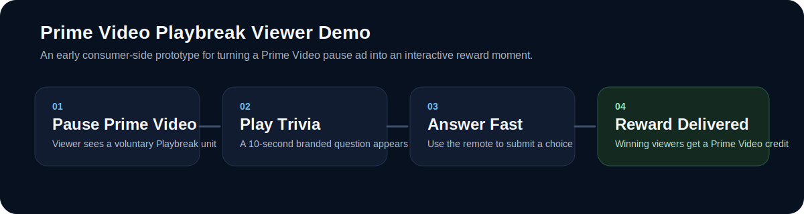
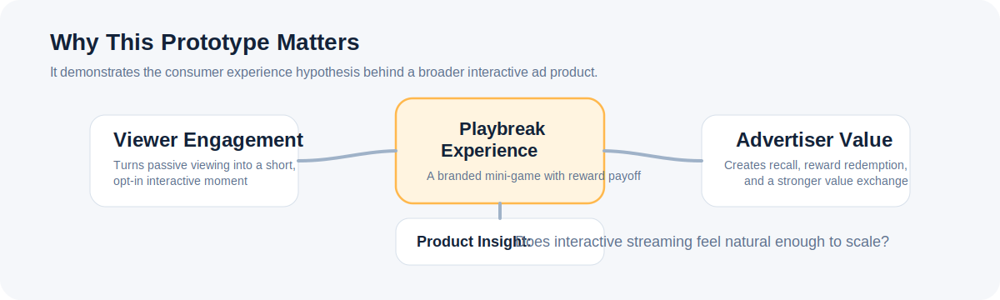

# Prime Video Playbreak Ads UI Mockup

A product mockup for `Playbreak`, a Prime Video pause-ad concept that turns a passive ad moment into a short, fully opt-in interactive game with an instant reward.

This repo focuses on the **viewer-side experience**: what the ad actually feels like inside Prime Video, how the interaction fits a lean-back environment, and how the viewer returns to content without friction.



## Overview

Playbreak is designed around a simple product idea:

**Take an existing Prime Video pause-ad moment and turn it into a 10-second branded interaction that gives the viewer a real reason to engage.**

In this mockup:

- a viewer pauses playback inside Prime Video
- a sponsored Playbreak unit appears in the pause moment
- the viewer opens a short branded trivia experience
- a correct answer unlocks a reward
- the viewer returns directly to playback

The prototype uses Toyota as the example advertiser and a Prime Video credit as the reward mechanic.

## Why This Exists

Most streaming ads are still passive by default. That creates a few product problems:

- viewers have little reason to actively engage
- advertisers get impressions, but not much intentional participation
- interactive ad concepts often sound compelling in strategy discussions but remain abstract
- product teams need a believable artifact to evaluate whether a new ad format feels native or disruptive

This mockup makes the idea concrete.

Instead of asking, "What if streaming ads were interactive?", it answers:

**"What would an interactive Prime Video pause ad actually feel like?"**

## What The Mockup Demonstrates

This repo is meant to explore several product questions:

- Can a reward-driven pause ad feel natural inside Prime Video?
- Is a 10-second interaction short enough to preserve the viewing experience?
- Does a trivia mechanic create a clear value exchange without feeling gimmicky?
- What should the transition from playback to interaction to reward look like?
- What parts of the viewer flow need to feel polished before advertiser tooling is worth building?



## Experience Flow

### 1. Prime Video pause moment

The mockup starts from a paused Prime Video playback surface rather than a generic TV home screen. The interaction is framed as a natural extension of the pause-ad environment.

### 2. Sponsored Playbreak unit

The viewer sees a sponsored ad card with a clear call to play, a visible 10-second constraint, and an explicit reward.

### 3. Timed interaction

The viewer answers one branded question using the remote. The interaction is optimized for legibility, speed, and minimal cognitive load.

### 4. Reward outcome

If the viewer answers correctly, the flow reveals a reward state with confirmation messaging and then returns to playback.

### 5. Return to content

The entire experience is self-contained so it feels like a lightweight moment inside Prime Video rather than a separate app flow.

## Connection To The Larger Product

This repo is the consumer-side counterpart to the advertiser console prototype in the companion repo.

If the broader product vision is:

- advertisers configure interactive Prime Video campaigns
- those campaigns run in pause, pre-roll, or live break moments
- engagement and reward outcomes are measured end to end

then this repo represents the most important proof point in that chain:

**the viewer interaction itself.**

## Who This Is For

This mockup is useful for:

- product managers exploring interactive ad formats
- designers prototyping streaming-native ad experiences
- engineers evaluating lean-back interaction patterns
- ads and monetization teams assessing viewer-value exchange
- stakeholders reviewing Prime Video ad innovation concepts

## Tech Stack

- Next.js
- React
- TypeScript
- Tailwind CSS

## Running Locally

```bash
npm install
npm run dev
```

Then open `http://localhost:3000`.

## Notes

- This is a product mockup, not a production ad system.
- Brand names, rewards, and UI content are illustrative.
- The goal is to communicate product thinking, surface design, and interaction quality rather than backend implementation depth.
